

**Table of Contents**

- [Temperature & Humidity Sensor at Home](#temperature---humidity-sensor-at-home)
  * [1. Introduction](#1-introduction)
    + [1.1 Motivation](#11-motivation)
    + [1.2 Goals](#12-goals)
  * [2. Methodology](#2-methodology)
    + [2.1 Phenomena of Interest](#21-phenomena-of-interest)
    + [2.2 Sensors Used](#22-sensors-used)
    + [2.3 Relative humidity-Humidity ratio](#23-relative-humidity-humidity-ratio)
    + [2.4 Thermal Comfort Method (PMV)](#24-thermal-comfort-method--pmv-)
    + [2.5 ASHARE Standard 55-2020](#25-ashare-standard-55-2020)
    + [2.6 Psychrometric chart (temperature vs. relative humidity)](#26-psychrometric-chart--temperature-vs-relative-humidity-)
    + [2.7 Center for the built environmental Thermal Comfort Tool](#27-center-for-the-built-environmental-thermal-comfort-tool)
    + [2.8 Humidifier](#28-humidifier)
    + [2.9 Coding Progress](#29-coding-progress)
      - [Code and Adafruit](#code-and-adafruit)
  * [3. Discussion](#3-discussion)

<small><i><a href='http://ecotrust-canada.github.io/markdown-toc/'>Table of contents generated with markdown-toc</a></i></small>

# Temperature & Humidity Sensor at Home
  * Zhixing Wang, Jeremy Yin, Xinyao Shen, Siwen Li

## 1. Introduction

### 1.1 Motivation

The winter in Pittsburgh is quite dry that humidifier is commonly used to keep people feel comfortable indoor. According to American Society of Heating, Refrigerating, and Air Conditioning Engineers (ASHRAE) Standard 55 - 2004 “Thermal Environmental Conditions for Human Occupancy, the thermal comfortable zone for people is related to many factors, among them, relative humidity and temperature are most concerned. However, most humidifier is unit, which means the sensor can only get relative humidity, and the sensor in humidifier is not that accurate. Based on these reasons, we want to use DHT-11 sensor to  provide a more user-friendly humidifier by increasing the accuracy and taking temperature into account.

### 1.2 Goals

* Improve the accuracy of humidity detected by humidifier by using an external sensor with higher sensitivity to meet humidity goals
* Relate temperature with humidity, adjust humidity to the comfortable zone by controlling the on and off of humidifier according to ASHRAE Standard 55 – 2004.

## 2. Methodology

### 2.1 Phenomena of Interest

Relative humidity-humidity ratio (specific humidity);

PMV thermal comfort Method and ASHRAE Standard 55-2020 comfortable range;

Psychrometric chart with dry-bulb temperature based on humidity ratio (temperature vs. relative humidity)

Furthermore, Center for the built environmental Thermal Comfort Tool will be applied in our project.[1]

Humidifier in our groups will also be listed at the last.

### 2.2 Sensors Used
* DHT11

Humidity measurement range: 20 - 90%RH

Humidity measurement accuracy: ±5%RH

Temperature measurement range: 0 - 50℃

Temperature measurement accuracy: ±2℃

Power supply: DC 3.5~5.5V; PCB size: 2.0 x 2.0 cm

Communicates a 40-bit data transfer from the DATA channel containing: [11]

    8-bit humidity integer data

    8-bit humidity decimal data

    8-bit temperature integer data

    8-bit temperature decimal data

    8-bit parity check data

 
Figure1. picture of DHT11[11]

DHT11 Pinout consists of 4 Pins in total, including Vcc, Data, N/C and Ground. Vcc is going to provide 3.3V to 5V at this pin. Data is going to provide a digital output. N/C is not connected. Ground is connected to 0V and GND. In order to have a direct understanding of the sensor, we show the DHT11 Pinout as the picture below: [8]

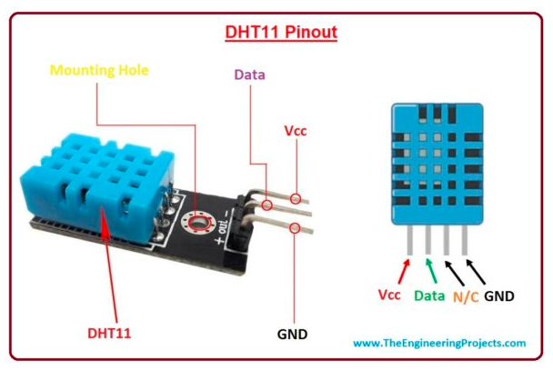

 
Figure2. DHT11 Pinout[8]

In order to discuss the working principle of DHT11, we must understand that there are two sensors inside it. Let’s have a look at both of them separately: [8]

**1) DHT11 Temperature Sensing**

In order to sense the temperature in the surrounding environment, DHT11 has an NTC(Negative Temperature Coefficient) temperature sensor(also called a thermistor) mounted on the surface inside the plastic casing. NTC temperature sensors are variable resistive sensors and their resistance decreases with an increase in the surrounding temperature. Thermistors are designed with sintering of semiconductors materials, such as ceramic or polymers and they provide a large change in resistor with a small change in temperature. Here’s the graph showing the relation between temperature and resistance for the DHT11 sensor: [8]

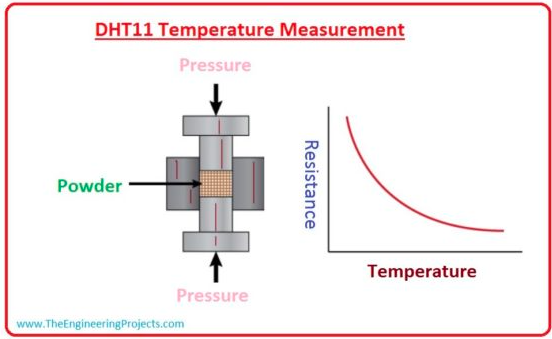

 
Figure3. DHT11 Temperature Measurement[8]

**2) DHT11 Humidity Sensing**

For Humidity Measurement, it uses a capacitive humidity sensor, which has two electrodes and a substrate material in between. The substrate material is used for holding the moisture on its surface. As moisture content changes in our environment, they are get saturated on the substrate material, which in turn changes the resistance between electrodes. This change in electrode resistivity is then calibrated using the humidity coefficient(saved in OTP memory) and the final relative humidity value is released. Here’s the image showing the internal structure of DHT11 humidity sensor: [8]

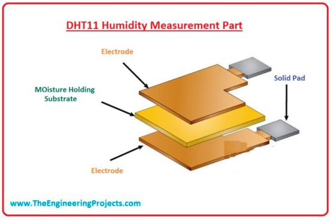

 
Figure4. DHT11 Humidity Measurement Part[8]

Next part, we will talk about DHT11 communication with microcontroller to explain its working principles. The circuit diagram to interface DHT11 with microcontroller is shown in the below figure: [8]

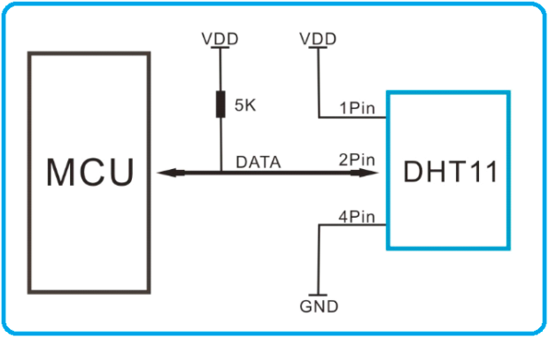

 
Figure5. Circuit Diagram of DHT11[8]

 
 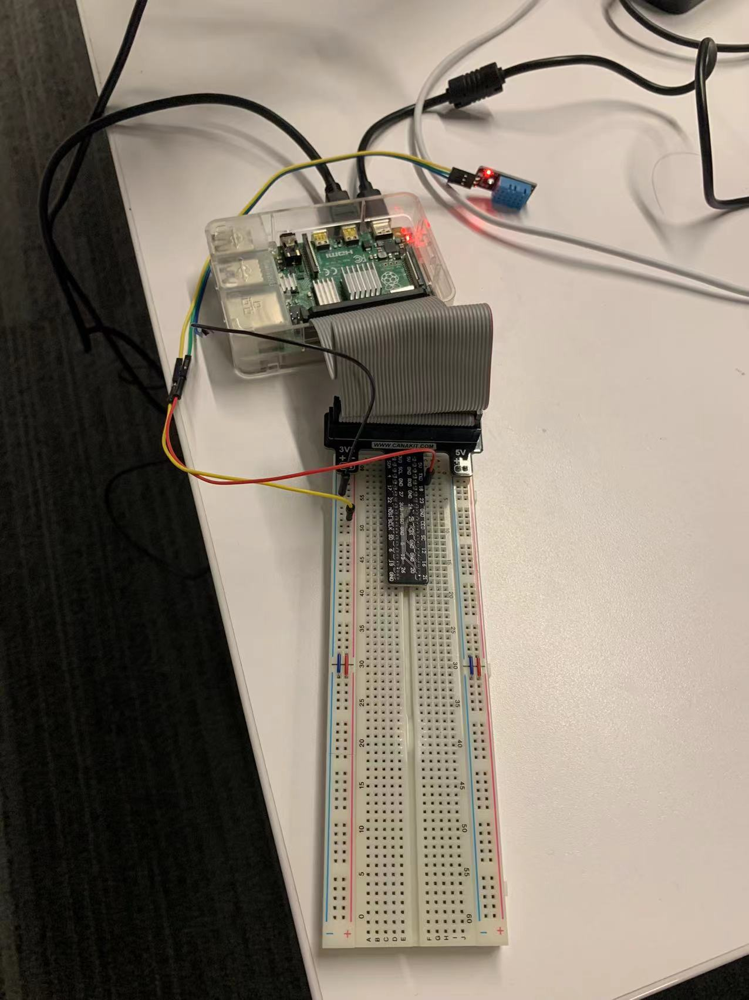

 
Figure22. Linking DHT11 with Raspberry Pi

Pull-up resistance of 5k ohm is recommended to place at the Data Pin of DHT11 sensor. At normal conditions, the data pin of DHT11 remains at the HIGH voltage level and the sensor remains in low power consumption mode. In order to receive data from the DHT11 sensor, the microcontroller should make the Data Pin low for at least 18us, so that the sensor could sense it. Once the DHT11 sensor senses the low signal at the Data Pin, it changes its state from low power consumption mode to running mode and waits for the Data Pin to get HIGH. As the Data Pin gets HIGH again by the microcontroller, DHT11 sends out the 40-Bit calibrated output value serially. After sending the data, DHT11 goes back to low power consumption mode and waits for the next command from the microcontroller. The microcontroller has to wait for 20-40us for getting a response from the DHT11 sensor.[8]

### 2.3 Relative humidity-Humidity ratio

The definition of humidity contains several aspects: **Absolute humidity, Relative humidity, Specific humidity (humidity ratio)**. Absolute humidity can be defined as the mass of H_2 O in certain amount of volume, which will be affected by air pressure and will also be affected by temperature if the volume is not a constant.AH is absolute humidity,$AH=\frac {m_{H_{2O}}}{V_{net}}$,unit is g/$m^3$

Relative humidity, Rh or ϕ is the ratio of partial pressure of water vapor in the mixture to the equilibrium vapor pressure of water over a flat surface of pure water at a given temperature.[2]  $ϕ=\frac {p_(H_{2O})}{p*(H_{2O})}$ (Partial pressure means the percentage of water pressure divided by total pressure.) Once the ϕ increase, air should be wetter and if it reaches to 100%, it will reach to dew point(participation). Relative humidity will be affected by temperature. **The colder air will get lower capacity to maintain vapors**.

Specific Humidity (humidity ratio) is the ratio of the mass of water vapor to total mass of the air parcel.[2] Approximate formula should be $\frac {m_{H_{2O}}}{m_{air}-m_{H_{2O}}(dry air)}$ , with unit kg/kg or g/kg. In our project we need also consider the transform formula for Specific Humidity and Relative humidity. It should be 

$$RH=100*\frac {ω}{ω_s} =0.263pq(exp⁡\frac {17.67(T-T_0)}{T-29.65})^{-1}$$,

$$ω_s=\frac {m_{vs}}{m_d} =\frac {0.622e_s}{p}(approximation)$$, es means saturation vapor pressure(pa), it can be get from vapor pressure of water table.[3]

ω means humidity ratio at certain cases,and ω_s  means saturation equilibrium humidiy ratio.

q means specific humidity same as ω(approximation),p certain case pressure(can be measured.)

### 2.4 Thermal Comfort Method (PMV)

The Predicted Mean Vote (PMV) model stands among the most recognized thermal comfort models. It was developed using principles of heat balance and experimental data collected in a controlled climate chamber under steady state conditions. [4]

Today, thermal comfort is defined as “that condition of mind that expresses satisfaction with the thermal environment” in the globally recognized ASHRAE 55 and ISO 7730 standards for evaluating indoor environments. To assess this condition, engineers must first determine the thermal sensation or thermal balance inhabitants of an indoor environment may feel in tangent with the thermal dissatisfaction experienced by occupants. These comfort limits can be expressed by the PMV and the PPD indices. [5]

**Our group will use PMV method to estimate the thermal comfort with ASHRAE standard and project comfortable range into Psychrometric chart.**

### 2.5 ASHARE Standard 55-2020

Standard 55 specifies conditions for acceptable thermal environments and is intended for use in design, operation, and commissioning of buildings and other occupied spaces. Standard 55 specifies conditions for acceptable thermal environments and is intended for use in design, operation, and commissioning of buildings and other occupied spaces. [6]

In our project, the table here can be utilized to estimate an exact value (the range is based on website tool from Berkeley.)

**Table 1 presents the values from the Canadian Standards Association (CSA) International's Standard** CAN/CSA Z412-00 - "Office Ergonomics" which gives temperature and relative humidity requirements for offices in Canada. These values are based on the American Society of Heating, Refrigerating, and Air Conditioning Engineers (ASHRAE) Standard 55 - 2004 "Thermal Environmental Conditions for Human Occupancy". These values are designed to meet the needs of 80% of individuals which means a few people will feel uncomfortable even if these values are met. Additional measures may be required. ASHRAE Standard 55 recommends a range of temperature and humidity values for thermal comfort in office work. 

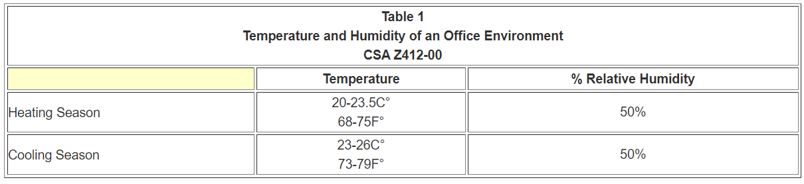

 
Figure6. Table of Temperature and Humidity[7]

 
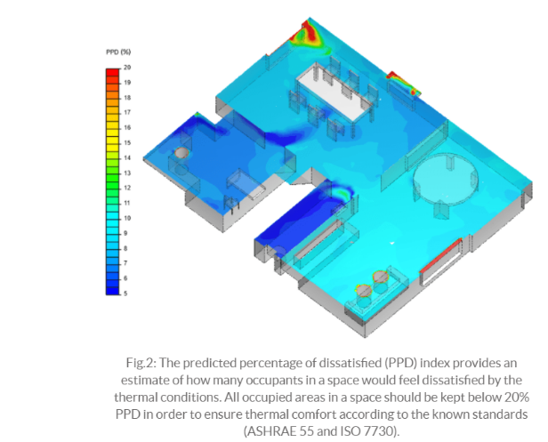
 
 
Figure7. ASHRAE application in computer[7]

**The reason we use ASHRAE Standard 55 in 2020 is that there is a good website that can manipulate inputs and outputs. (Temperature, relative humidity, humidity ratio and thermal comfortable range.)**

### 2.6 Psychrometric chart (temperature vs. relative humidity)

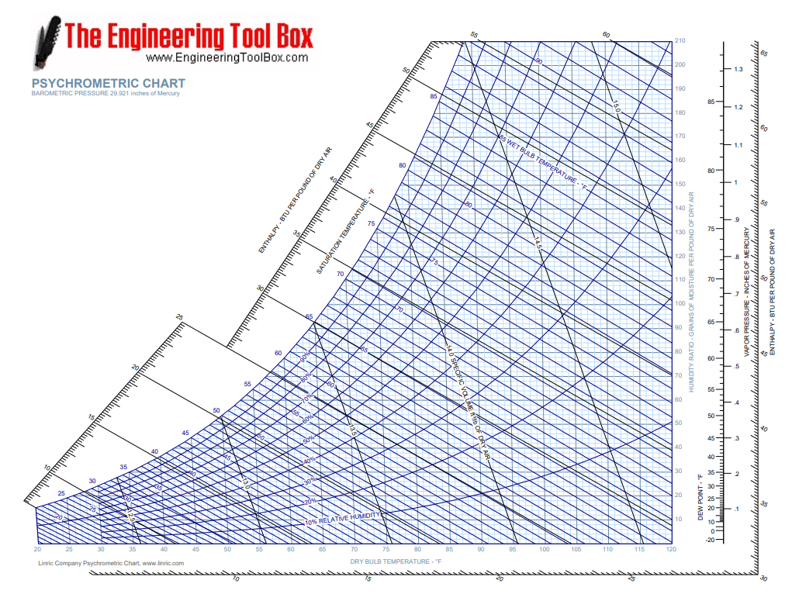

 
Figure8. Psychrometric Chart[10]

As you can see, this chart comes from Thompson, and it is used in recent engineering program to estimate facts. **The X-axis means dry bulb temperature, Y-axis means humidity ratio, and relative humidity in parabola.** 

In next part, the thermal comfort tool is based on this chart to generate exact figure for our project.

### 2.7 Center for the built environmental Thermal Comfort Tool

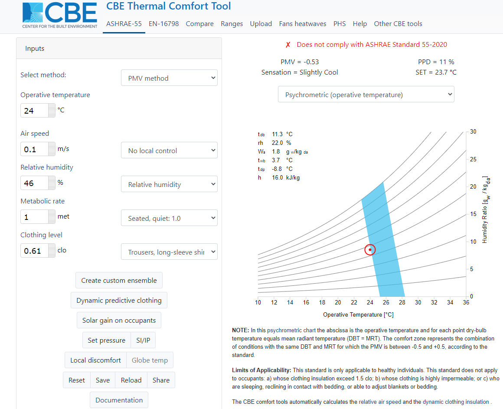

 
Figure9. Out of range in chart[1]

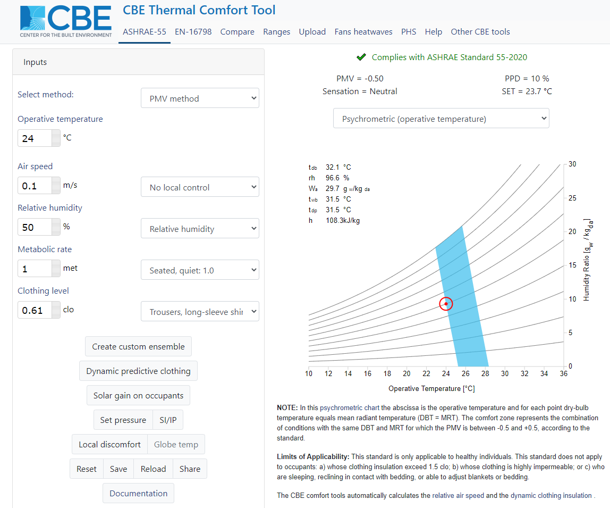

 
Figure10. In the range in chart[1]

The website tool contains inputs and outputs. **In our projects, the main two parts is temperature and relative humidity**. The other inputs, as **assumptions**, including **Air speed, metabolic rate, and clothing level, is related to ASHRAE Standard 55-2020 to get the range**. We use the formula to check with the humidity ratio that comes from relative humidity (which is closed to the chart in tool).[1]

We get sensor value for temperature 24C and relative humidity for 46% and it’s out of thermal comfort range. In Figure 2., it shows the humidifier should work until the relative humidity reach 50%, which means it’s on thermal comfort range. 

In this case, the humidifier should be on working. However, according to humidifier’s shortcomings in accuracy and unity (can’t reach temperature value.), our humidifier didn’t release the vapor. 

### 2.8 Humidifier

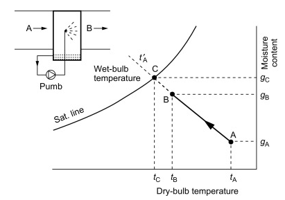

 
Figure11. The structure of humidifier & relationship between chart[9]

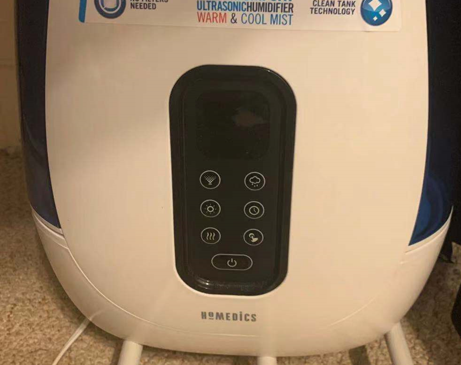

 
Figure12. Total view of humidifier

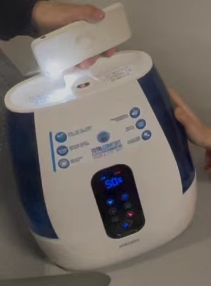

 
Figure13. Not vaporizing humidifier

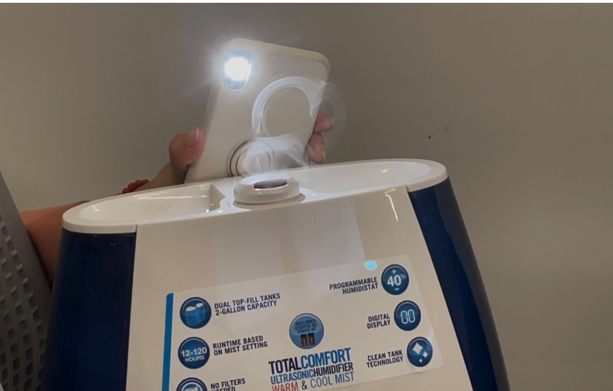

 
Figure14. Vaporizing humidifier

*summary of humidifier*
The humidifier limits are based on several aspects:
1.	**Inaccuracy** 
The humidity is inaccurate because its sensor is on the circuit. In this case, it might be inaccurate. However, DHT11 in Raspberry Pi is directly connected to air which is accurate.
2.	**Unity**
The humidifier’s sensor can only get the value in relative humidity not temperature. It can not get the correct thermal comfort range to release vapor efficiently. 

### 2.9 Coding Progress

#### Code and Adafruit

Our python script was inspired by the in class adafruit tutorial and the dht11 tutorial from homework 2. FIrst, we imported several modules including **sys**, **RPi.GPIO**, **time**, **MQTTClient** from **Adafruit_IO**, and **dht11** from our **dht.py** script.

We started out by setting up the code to locate the various elements on the breadboard in the BCM format and created an instance of the dht-11 sensor. Next, we created a new feed to listen for the humidity data and set the Adafruit username and key. After initializing our client instance with the username and key, we connected the client to the Adafruit servers. We were then able to publish the humidity values collected from our dht11 instance and also print out the current humidity values. These values are then sampled every 5 seconds. We then repeated the process for temperature.

Our data from the humidity output contained a lot of zero values. In order to bypass this, the script was set to publish the last non-zero value to the server. This results in a cleaner looking graph with less sporadic changes.

Our feed along with a real-time chart is displayed on the Adafruit website's feed page. Here, there is a graph plotting the real-time values along with a list of historical data values. There is a seperate feed for both humidity and temperature which is used to display two different gauges in our dht11 dashboard. We set a standard humidity and temperature range for our gauge because it does not take conditional ranges.

Our code is listed below:

        # Import standard python modules.
        import sys
        import RPi.GPIO as GPIO
        import time

        # Import Adafruit IO MQTT client.
        from Adafruit_IO import MQTTClient

        import dht11

        Temp_sensor=14
        GPIO.setwarnings(False)
        GPIO.setmode(GPIO.BCM)       # Use BCM GPIO numbers
        # Initialise display
        #  lcd_init()
        instance = dht11.DHT11(pin = Temp_sensor)

        ADAFRUIT_IO_USERNAME = "Onethighandthreeleghairs"
        ADAFRUIT_IO_KEY = "aio_EnPO18As4BB1wkgScw4XScFmUWAS"

        # Set to the ID of the feed to subscribe to for updates.
        FEED_ID = 'DHT11'

        # Define callback functions which will be called when certain events happen.
        def connected(client):
            # Connected function will be called when the client is connected to Adafruit IO.
            # This is a good place to subscribe to feed changes.  The client parameter
            # passed to this function is the Adafruit IO MQTT client so you can make
            # calls against it easily.
            print('Connected to Adafruit IO!  Listening for {0} changes...'.format(FEED_ID))
            # Subscribe to changes on a feed named DemoFeed.
            client.subscribe(FEED_ID)

        def subscribe(client, userdata, mid, granted_qos):
            # This method is called when the client subscribes to a new feed.
            print('Subscribed to {0} with QoS {1}'.format(FEED_ID, granted_qos[0]))

        def disconnected(client):
            # Disconnected function will be called when the client disconnects.
            print('Disconnected from Adafruit IO!')
            sys.exit(1)

        def message(client, feed_id, payload):
            # Message function will be called when a subscribed feed has a new value.
            # The feed_id parameter identifies the feed, and the payload parameter has
            # the new value.
            print('Feed {0} received new value: {1}'.format(feed_id, payload))

        # Create an MQTT client instance.
        client = MQTTClient(ADAFRUIT_IO_USERNAME, ADAFRUIT_IO_KEY)

        # Setup the callback functions defined above.
        client.on_connect    = connected
        client.on_disconnect = disconnected
        client.on_message    = message
        client.on_subscribe  = subscribe

        # Connect to the Adafruit IO server.
        client.connect()
        saved_data_h = 0
        saved_data_t = 0
        def main():
          while True:
            try:
              client.loop()
            except:
              print("Failed to get data, retrying\n", e)
              client.reconnect()
              continue

            result = instance.read()
            if result.humidity == 0:
                client.publish('humidity', saved_data_h)
            else:
                client.publish('humidity', result.humidity)
                saved_data_h = result.humidity

            if result.temperature == 0:
                client.publish('temperature', saved_data_t)
            else:
                client.publish('temperature', result.temperature)
                saved_data_t = result.temperature

            print('humidity: ',result.humidity)
            print('temperature: ',result.temperature)
            time.sleep(5)

        if __name__ == '__main__':
            try:
                main()
            except KeyboardInterrupt:
                GPIO.cleanup()
                client.disconnect()
                sys.exit(0)

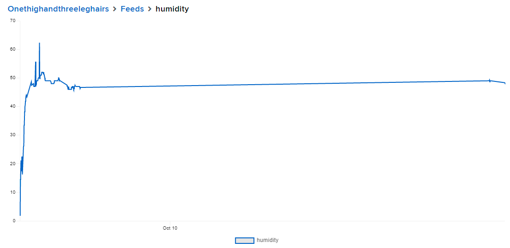

 
Figure15. Historic records of humidity

 
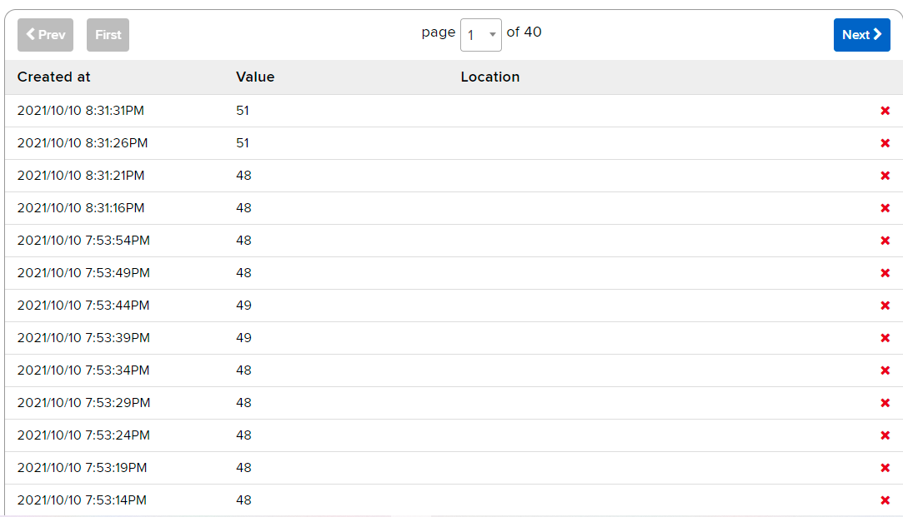

 
Figure16. Historic data of humidity

 
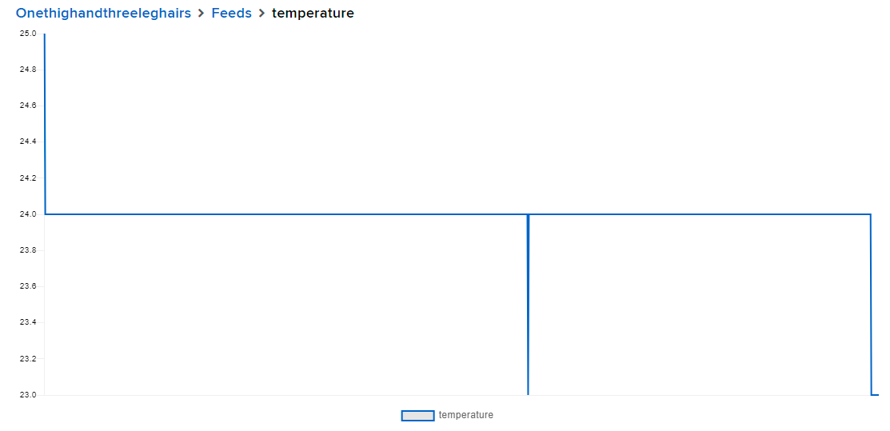

 
Figure17. Historic records of temperature

 
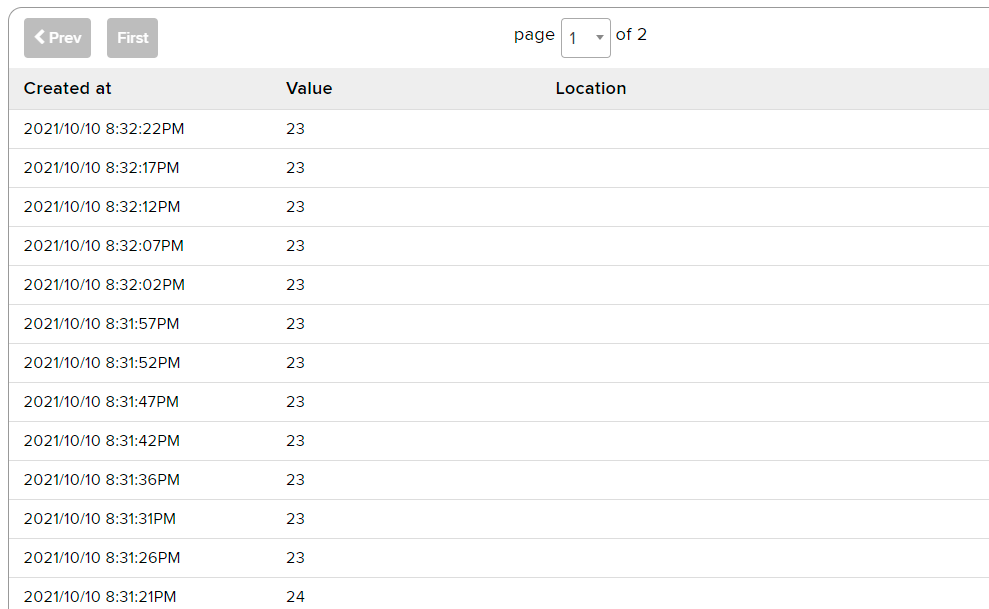

 
Figure18. Historic data of temperature

 
 We also tested dht11 and our system in different conditions. As the following figures show, the link between adafruit and sensor works well!
 
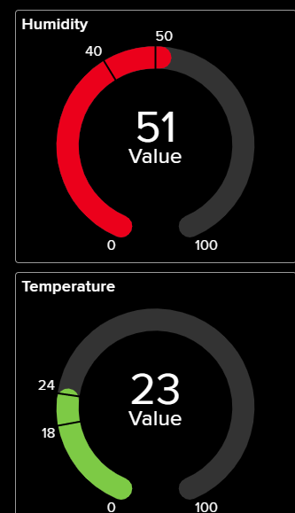

 
Figure19. Gauge of high humidity in adafruit

 
 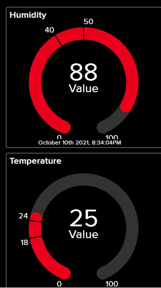

 
Figure20. Gauge of high humidity and temperature in adafruit

 
 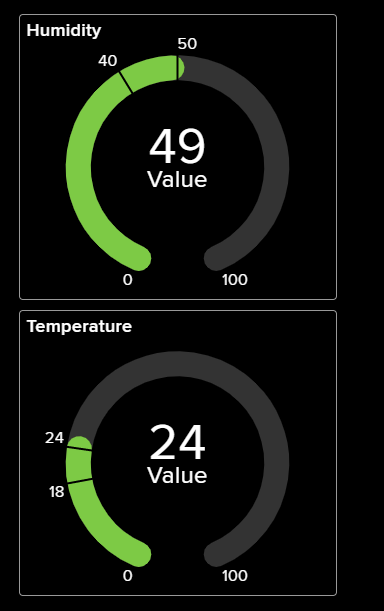

 
Figure21. Gauge of normal humidity in adafruit

## 3. Discussion

In this project, we presented a practical problem of how to provide more friendly control of our humidifier. We choose sensors, validate methods and test procedures to achieve our goals. We aim at achieving a method through humidifier to adjust the humidity to the most comfortable range of the human body without changing the temperature. After understanding the phenomena that we were interested in, we chose DHT 11 to achieve our goals, designed the circuit and wrote the code.

Temperature and humidity data are collected from the DHT11 sensor. Then we use the CBE Thermal Comfort Tool to check whether the temperature and humidity are within the most comfortable range. Finally, we switch on or off the humidifier artificially. In this process, we have a deeper understanding of humidity, the temperature and humidity that the human body feels and its influencing factors, we are familiar with the whole process of using the sensor and master the use of Ada fruit.

Although we spent a lot of time on this project, but due to the limitation of damage to the sensor equipment, there are still some imperfections. First, our understanding of CBE Thermal Comfort Tool is not deep enough that we are not able to directly use the Raspberry Pi code to judge the comfortable temperature and humidity range of the human body and send reminders to the mobile phone. Secondly, we only used DHT 11 to detect temperature and humidity, and no more sensors were used. Therefore, if there is a chance, we can design a more mature system to directly judge whether the humidity appears in the most suitable range for the human body. If it does not, the Raspberry Pi will directly send a reminder to the mobile phone to turn on or turn off the humidifier. So, there are some problems that we want to solve in the future.

Through this group project, we have also solved different types of problems, which enhanced our understanding of humidity, DHT 11 sensors, Raspberry Pi codes and Adafruit.

Thanks to Professor Mario and teaching assistants for their help. Their help and patience allowed us to successfully complete this project.

**Reference**

[1] CBE Thermal Comfort Tool. (n.d.). CBE Thermal Comfort Tool. Retrieved October 12, 2021, from https://comfort.cbe.berkeley.edu/

[2] Wikipedia contributors. (2021, September 16). Humidity. Wikipedia. https://en.wikipedia.org/wiki/Humidity#Specific_humidity

[3] Vapor Pressure of Water from 0 °C to 100 °C. (n.d.). Vapor Pressure of Water. Retrieved October 12, 2021, from https://www.wiredchemist.com/chemistry/data/vapor-pressure

[4] Wikipedia contributors. (2021a, September 14). Thermal comfort. Wikipedia. https://en.wikipedia.org/wiki/Thermal_comfort#Thermal_comfort_models

[5] Guenther, S. (2021, June 14). What Is PMV? What Is PPD? The Basics of Thermal Comfort. SimScale. https://www.simscale.com/blog/2019/09/what-is-pmv-ppd/

[6] Standard 55 Thermal Environmental Conditions for Human Occupancy. (n.d.). Web Starter Kit. Retrieved October 12, 2021, from https://www.ashrae.org/technical-resources/bookstore/standard-55-thermal-environmental-conditions-for-human-occupancy

[7] Temperature and Humidity. (n.d.). Temperature and Humidity. Retrieved October 12, 2021, from https://www.oshatrain.org/courses/pages/711temp.html

[8] Ali, Z. (2021, August 16). Introduction to DHT11. The Engineering Projects. https://www.theengineeringprojects.com/2019/03/introduction-to-dht11.html

[9] Humidifier - an overview | ScienceDirect Topics. (n.d.). Humidifier. Retrieved October 12, 2021, from https://www.sciencedirect.com/topics/engineering/humidifier

[10] Air - Psychrometric Chart for Standard Atmospheric Conditions - Imperial Units. (n.d.). Air - Psychrometric Chart. Retrieved October 12, 2021, from https://www.engineeringtoolbox.com/psychrometric-chart-d_816.html

[11] DHT11 basic temperature-humidity sensor + extras. (n.d.). Adafruit. Retrieved October 12, 2021, from https://www.adafruit.com/product/386
